# NixOS Configuration

Welcome to my highly professional, declarative NixOS configuration! ❄️

This repository manages the system configuration, packages, and dotfiles for my machine(s) using Nix flakes and Home Manager. It is designed to be fully reproducible, strictly stylized, and optimized for a modern Wayland workflow.

## 🌟 Key Features

- **Window Manager**: [Hyprland](https://hyprland.org/), providing a buttery smooth Wayland compositor experience.
- **Status Bar**: [Waybar](https://github.com/Alexays/Waybar) with a highly customized layout and native Stylix color injection.
- **Application Launcher**: [Rofi (Wayland)](https://github.com/lbonn/rofi) configured with a custom, horizontal `.rasi` theme featuring dynamic image embedding.
- **Terminal**: [Alacritty](https://alacritty.org/) with `zsh` as the default shell.
- **Global Theming**: [Stylix](https://github.com/danth/stylix) applies a unified `Base16Kvantum` theme (and fonts like JetBrainsMono) across the *entire* OS automatically.
- **Secrets Management**: [sops-nix](https://github.com/Mic92/sops-nix) handles sensitive data (passwords, tokens) using age encryption.
- **Power Management**: Auto-tuned specifically for modern Intel/NVIDIA hybrid setups (PRIME, `finegrained` D3 state, `intel_pstate` scaling).
- **Security Hardened**: Built-in AppArmor profiles and `auditd` logging configured centrally.
- **Code Quality**: Pre-commit hooks enforce strict formatting (`nixfmt`, `stylua`) and static analysis (`statix`, `deadnix`).

## 📂 Repository Structure

The repository is modularly organized to separate system-wide behavior from user-specific dotfiles.

```text
├── flake.nix                  # Entry point defining inputs, outputs, and formatting
├── hosts/
│   └── laptop/
│       ├── configuration.nix  # Core system configuration for the "twin" host
│       └── home/
│           └── home.nix       # Home Manager entry point for the user
├── modules/
│   ├── nixos/                 # System-level modules (hardware, drivers, sops, security)
│   └── home-manager/          # User-level modules (Hyprland, Waybar, Rofi, Stylix)
├── overlays/                  # Centralized Nixpkgs overlays (custom kernels, packages)
├── modules/nixos/system/secrets/secrets.yaml # Encrypted SOPS data
├── .sops.yaml                 # SOPS configuration file
└── treefmt.nix                # Unified formatting and linting configuration
```



```mermaid
flowchart TD

subgraph group_composition["Composition"]
  node_flake["Flake<br/>composition<br/>[flake.nix]"]
end

subgraph group_host["Laptop host"]
  node_laptop["Laptop host<br/>nixos host<br/>[configuration.nix]"]
  node_disk["Disk config<br/>storage<br/>[disk-config.nix]"]
  node_hardware["Hardware cfg<br/>platform hw"]
  node_homeentry["Home entry<br/>hm entry<br/>[home.nix]"]
end

subgraph group_nixos["NixOS layer"]
  node_nixosmods["NixOS mods<br/>module set<br/>[default.nix]"]
  node_coreos["Core system<br/>nixos base<br/>[core.nix]"]
  node_users["Users<br/>account mgmt<br/>[users.nix]"]
  node_security["Security<br/>hardening<br/>[security.nix]"]
  node_sops["Secrets<br/>sops-nix<br/>[sops.nix]"]
  node_hardwaretune["HW tweaks<br/>platform tune"]
  node_nvidia["NVIDIA<br/>gpu support<br/>[nvidia.nix]"]
  node_desktopsys["Desktop sys<br/>desktop enablement<br/>[desktop.nix]"]
  node_fonts["Fonts<br/>font stack<br/>[fonts.nix]"]
  node_hyprsys["Hyprland sys<br/>session base<br/>[hyprland.nix]"]
  node_apps["Apps<br/>game stack<br/>[gaming.nix]"]
  node_steam["Steam<br/>gaming<br/>[steam.nix]"]
end

subgraph group_home["Home Manager"]
  node_homenix["Home modules<br/>hm module set<br/>[default.nix]"]
  node_corehome["User core<br/>hm base<br/>[core.nix]"]
end

subgraph group_desktop["Desktop runtime"]
  node_desktophm["Desktop stack<br/>hm desktop<br/>[hyprland.nix]"]
  node_hyprland["Hyprland<br/>wayland compositor<br/>[hyprland.nix]"]
  node_waybar["Waybar<br/>panel<br/>[waybar.nix]"]
  node_rofi["Rofi<br/>launcher<br/>[rofi.nix]"]
  node_hypridle["Hypridle<br/>idle mgr<br/>[hypridle.nix]"]
  node_hyprlock["Hyprlock<br/>lock screen<br/>[hyprlock.nix]"]
  node_swaync["SwayNC<br/>notifications<br/>[swaync.nix]"]
end

subgraph group_cli["CLI tools"]
  node_cli["CLI stack<br/>user tools<br/>[alacritty.nix]"]
  node_alacritty["Alacritty<br/>terminal<br/>[alacritty.nix]"]
  node_helix["Helix<br/>editor<br/>[helix.nix]"]
  node_zsh["Zsh<br/>shell<br/>[zsh.nix]"]
end

subgraph group_systemui["System UI"]
  node_gtk["GTK<br/>theme bridge<br/>[gtk.nix]"]
  node_stylix["Stylix<br/>theme engine<br/>[stylix.nix]"]
end

subgraph group_ops["Operations"]
  node_tooling["Tooling<br/>fmt/hooks<br/>[treefmt.nix]"]
  node_secretfile["Secret store<br/>encrypted secrets<br/>[secrets.yaml]"]
  node_sopsconfig["SOPS config<br/>sops settings<br/>[.sops.yaml]"]
end

node_flake -->|"builds host"| node_laptop
node_flake -->|"imports"| node_nixosmods
node_flake -->|"imports"| node_homenix
node_flake -.->|"dev workflow"| node_tooling
node_laptop -->|"platform"| node_hardware
node_laptop -->|"storage"| node_disk
node_laptop -->|"hands off"| node_homeentry
node_laptop -->|"uses"| node_coreos
node_laptop -->|"uses"| node_users
node_laptop -->|"uses"| node_security
node_laptop -->|"secrets"| node_sops
node_sops -.->|"reads"| node_secretfile
node_sops -.->|"uses"| node_sopsconfig
node_nixosmods -->|"includes"| node_desktopsys
node_nixosmods -->|"includes"| node_fonts
node_nixosmods -->|"includes"| node_hyprsys
node_nixosmods -->|"includes"| node_hardwaretune
node_nixosmods -->|"includes"| node_nvidia
node_nixosmods -->|"includes"| node_apps
node_apps -->|"includes"| node_steam
node_homenix -->|"includes"| node_corehome
node_homenix -->|"includes"| node_gtk
node_homenix -->|"includes"| node_stylix
node_homenix -->|"includes"| node_cli
node_homenix -->|"includes"| node_desktophm
node_cli -->|"contains"| node_alacritty
node_cli -->|"contains"| node_helix
node_cli -->|"contains"| node_zsh
node_desktophm -->|"contains"| node_hyprland
node_desktophm -->|"contains"| node_waybar
node_desktophm -->|"contains"| node_rofi
node_desktophm -->|"contains"| node_hypridle
node_desktophm -->|"contains"| node_hyprlock
node_desktophm -->|"contains"| node_swaync
node_hyprland -.->|"styled by"| node_stylix
node_waybar -.->|"styled by"| node_stylix
node_rofi -.->|"styled by"| node_stylix
node_gtk -->|"bridges"| node_stylix

click node_flake "https://github.com/rushabhp-droid/nixos-conf/blob/next/flake.nix"
click node_tooling "https://github.com/rushabhp-droid/nixos-conf/blob/next/treefmt.nix"
click node_laptop "https://github.com/rushabhp-droid/nixos-conf/blob/next/hosts/laptop/configuration.nix"
click node_disk "https://github.com/rushabhp-droid/nixos-conf/blob/next/hosts/laptop/disk-config.nix"
click node_hardware "https://github.com/rushabhp-droid/nixos-conf/blob/next/hosts/laptop/hardware-configuration.nix"
click node_homeentry "https://github.com/rushabhp-droid/nixos-conf/blob/next/hosts/laptop/home/home.nix"
click node_nixosmods "https://github.com/rushabhp-droid/nixos-conf/blob/next/modules/nixos/default.nix"
click node_coreos "https://github.com/rushabhp-droid/nixos-conf/blob/next/modules/nixos/system/core.nix"
click node_users "https://github.com/rushabhp-droid/nixos-conf/blob/next/modules/nixos/system/users.nix"
click node_security "https://github.com/rushabhp-droid/nixos-conf/blob/next/modules/nixos/system/security.nix"
click node_sops "https://github.com/rushabhp-droid/nixos-conf/blob/next/modules/nixos/system/sops.nix"
click node_secretfile "https://github.com/rushabhp-droid/nixos-conf/blob/next/modules/nixos/system/secrets/secrets.yaml"
click node_sopsconfig "https://github.com/rushabhp-droid/nixos-conf/blob/next/.sops.yaml"
click node_hardwaretune "https://github.com/rushabhp-droid/nixos-conf/blob/next/modules/nixos/hardware/hardware-tweaks.nix"
click node_nvidia "https://github.com/rushabhp-droid/nixos-conf/blob/next/modules/nixos/hardware/nvidia.nix"
click node_desktopsys "https://github.com/rushabhp-droid/nixos-conf/blob/next/modules/nixos/desktop/desktop.nix"
click node_fonts "https://github.com/rushabhp-droid/nixos-conf/blob/next/modules/nixos/desktop/fonts.nix"
click node_hyprsys "https://github.com/rushabhp-droid/nixos-conf/blob/next/modules/nixos/desktop/hyprland.nix"
click node_apps "https://github.com/rushabhp-droid/nixos-conf/blob/next/modules/nixos/apps/gaming.nix"
click node_steam "https://github.com/rushabhp-droid/nixos-conf/blob/next/modules/nixos/apps/steam.nix"
click node_homenix "https://github.com/rushabhp-droid/nixos-conf/blob/next/modules/home-manager/default.nix"
click node_corehome "https://github.com/rushabhp-droid/nixos-conf/blob/next/modules/home-manager/system/core.nix"
click node_gtk "https://github.com/rushabhp-droid/nixos-conf/blob/next/modules/home-manager/system/gtk.nix"
click node_stylix "https://github.com/rushabhp-droid/nixos-conf/blob/next/modules/home-manager/system/stylix.nix"
click node_cli "https://github.com/rushabhp-droid/nixos-conf/blob/next/modules/home-manager/cli/alacritty.nix"
click node_alacritty "https://github.com/rushabhp-droid/nixos-conf/blob/next/modules/home-manager/cli/alacritty.nix"
click node_helix "https://github.com/rushabhp-droid/nixos-conf/blob/next/modules/home-manager/cli/helix.nix"
click node_zsh "https://github.com/rushabhp-droid/nixos-conf/blob/next/modules/home-manager/cli/zsh.nix"
click node_desktophm "https://github.com/rushabhp-droid/nixos-conf/blob/next/modules/home-manager/desktop/hyprland.nix"
click node_hyprland "https://github.com/rushabhp-droid/nixos-conf/blob/next/modules/home-manager/desktop/hyprland.nix"
click node_waybar "https://github.com/rushabhp-droid/nixos-conf/blob/next/modules/home-manager/desktop/waybar.nix"
click node_rofi "https://github.com/rushabhp-droid/nixos-conf/blob/next/modules/home-manager/desktop/rofi.nix"
click node_hypridle "https://github.com/rushabhp-droid/nixos-conf/blob/next/modules/home-manager/desktop/hypridle.nix"
click node_hyprlock "https://github.com/rushabhp-droid/nixos-conf/blob/next/modules/home-manager/desktop/hyprlock.nix"
click node_swaync "https://github.com/rushabhp-droid/nixos-conf/blob/next/modules/home-manager/desktop/swaync.nix"

classDef toneNeutral fill:#f8fafc,stroke:#334155,stroke-width:1.5px,color:#0f172a
classDef toneBlue fill:#dbeafe,stroke:#2563eb,stroke-width:1.5px,color:#172554
classDef toneAmber fill:#fef3c7,stroke:#d97706,stroke-width:1.5px,color:#78350f
classDef toneMint fill:#dcfce7,stroke:#16a34a,stroke-width:1.5px,color:#14532d
classDef toneRose fill:#ffe4e6,stroke:#e11d48,stroke-width:1.5px,color:#881337
classDef toneIndigo fill:#e0e7ff,stroke:#4f46e5,stroke-width:1.5px,color:#312e81
classDef toneTeal fill:#ccfbf1,stroke:#0f766e,stroke-width:1.5px,color:#134e4a
class node_flake,node_gtk,node_stylix toneBlue
class node_laptop,node_disk,node_hardware,node_homeentry,node_tooling,node_secretfile,node_sopsconfig toneAmber
class node_nixosmods,node_coreos,node_users,node_security,node_sops,node_hardwaretune,node_nvidia,node_desktopsys,node_fonts,node_hyprsys,node_apps,node_steam toneMint
class node_homenix,node_corehome toneRose
class node_desktophm,node_hyprland,node_waybar,node_rofi,node_hypridle,node_hyprlock,node_swaync toneIndigo
class node_cli,node_alacritty,node_helix,node_zsh toneTeal
```

## 🚀 Installation & Usage

### Rebuilding the System

This system uses `nh` (Nix Helper) for building and deploying configurations. To apply the configuration, simply run:

```bash
nh os switch
```

*Note: For testing changes without applying them to the bootloader, use `nh os build` instead of `switch`.*

### Code Formatting & Linting

This repository enforces strict code quality using `treefmt` (which wraps `nixfmt` for Nix files, `stylua` for Lua files, `statix` for anti-patterns, and `deadnix` for unused variables). 

You can automatically format and lint the entire repository by running:

```bash
nix fmt
```

A pre-commit hook is automatically provided via the flake's development shell. Simply run `nix develop` to install it into your local `.git/hooks/pre-commit`, ensuring all commits meet the repository's quality standards.

### Managing Secrets

Secrets are managed via `sops-nix` and `age`. For detailed instructions on how to encrypt new secrets, add keys, or decrypt existing files, please refer to the documentation inside `modules/nixos/secrets/README.md`.

## ⚙️ Maintenance 

- **Updating inputs:** `nix flake update`
- **Garbage Collection:** `nh clean all` (Automatically runs weekly, keeping 3 generations within the last 7 days)
